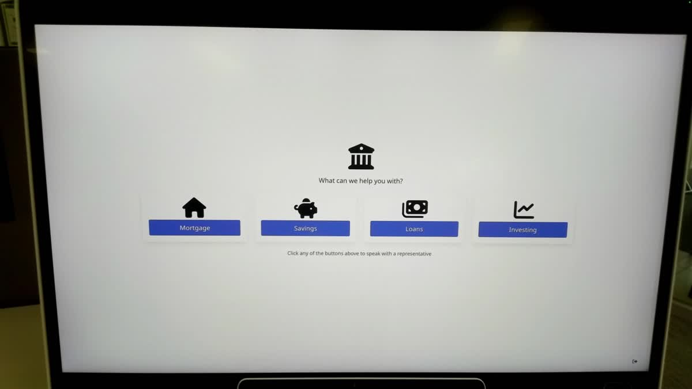

# Kiosk Lock Macro

This is an example Cisco Desk and Board macro for locking and unlocking ( enable and disabling Kiosk mode) by leveraging a custom PIN prompt.

## Overview

The macro saves UI Extension buttons to both the ``Homescreen`` and ``Control Panel`` of the device.

While in Kiosk Mode, a user can access the Control Panel by tapping on the open web app three times with three fingers.

Tapping on the ``Unlock Device`` button opens a PIN prompt and if the correct PIN is entered, Kiosk Mode is disabled allowing access to the RoomOS interface.

The Device can be locked at any time by tapping either of the ``Lock Device`` buttons.

Custom button icons are downloaded by the macro from online sources for a smaller macro file size.

## Setup

### Prerequisites & Dependencies: 

- Webex Desk or Board series device running RoomOS/CE 11.11 or greater
- Web admin access to the device to upload the macro.

### Installation Steps:
1. Download the ``kiosk-lock.js`` file and upload it to your Webex Room devices Macro editor via the web interface.
2. Configure the Macro by changing the initial values, there are comments explaining each one.
3. Enable the Macro on the editor.
    

## Demo

*For more demos & PoCs like this, check out our [Webex Labs site](https://collabtoolbox.cisco.com/webex-labs).

## License

All contents are licensed under the MIT license. Please see [license](LICENSE) for details.

## Disclaimer

 Everything included is for demo and Proof of Concept purposes only. Use of the site is solely at your own risk. This site may contain links to third party content, which we do not warrant, endorse, or assume liability for. These demos are for Cisco Webex use cases, but are not Official Cisco Webex Branded demos.

## Questions
Please contact the WXSD team at [wxsd@external.cisco.com](mailto:wxsd@external.cisco.com?subject=kiosk-lock-macro) for questions. Or, if you're a Cisco internal employee, reach out to us on the Webex App via our bot (globalexpert@webex.bot). In the "Engagement Type" field, choose the "API/SDK Proof of Concept Integration Development" option to make sure you reach our team. 
